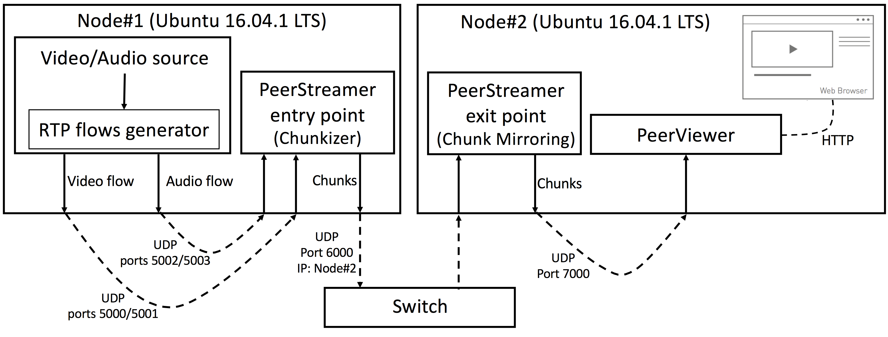

# Testing procedure for PeerStreamer

PeerStreamer for CNs is split in two applications, the streaming
engine that runs on a CN node, equipped with OpenWRT and a dedicated
device which runs PeerViewer, the web-based visualizer of the video.

In a typical configuration, the streaming engine written in C runs on
the router node, it does only the "chunk trading" function and requires
few computation resources. Another node runs PeerViewer, it can be a
PC, an embedded device such as a Raspberry. PeerViewer opens a web
interface where the video is streamed, anybody accessing the web interface
can watch the video.

To perform tests one needs to set-up the following testing environment,
in increasing complexity.

### High level software architecture

The figures reports an hihg level architecture of the software modules required
for running initial tests. PeerStreamer and PeerViewer are provided by Unitn.
for the other modules, standard open source tools are used.

* Video/Audio source: for initial testing a file containing audio+video will be
  used. Currently supported format are: VP8 for video, Opus or MP3 for audio).
Unitn can provide the video testing files.

* RTP flows generator: any software capable of generating Video/Audio RTP/RTCP
  sessions (e.g., VLC, ffmpeg, GStreamer). Unitn will provide test examples with
GStreamer.

* PeerStreamer entry/exit points: peerstreamer software. Unitn will provide
  examples for building and executing it.

* RTP flows parser: when the PeerStreamer exit point is configured as a
  dechunkizer it will output the original RTP/RTCP sessions. In this case a
proper RTP/RTCP session parser is required (e.g., VLC, ffmper, GStreamer). Unitn
will provide examples with GStreamer.

* Video/Audio Player: if the RTP flows parser is used, a proper player is
  required for reproducing the video in real time (e.g., ffplay, VLC).

* PeerViewer: this software is provided by Unitn and it's purpose is to
  dechinkise
the chunks produced by the PeerStreamer exit point and converting them in an
HTTP flow which enables a web browser to reproduce the video/audio in real-time.
Any modern web browser can be used for this purpose. Most of the initial tests
will relies on PeerViewer for reproducing the multimedia content.

## Simple testing, one host

PeerStreamer framework testing on a single node requires a device running Ubuntu
16.04.1 LTS (other Ubuntu versions or Linux distributions might be supported but
have not been tested).

## Two-nodes testing

## Real network testing

## What to test

