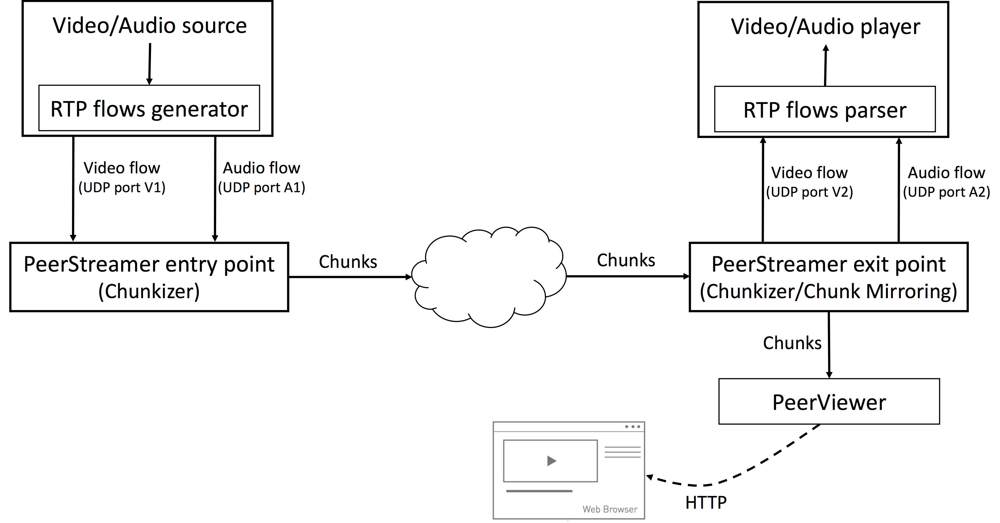
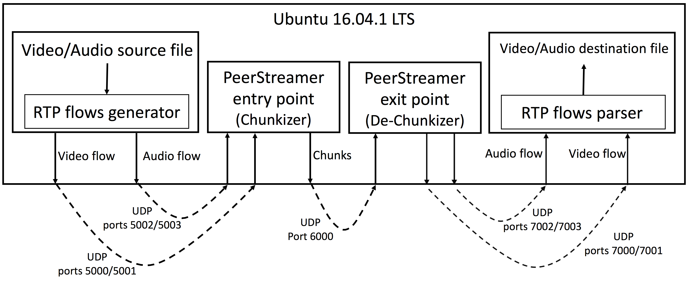

# Testing procedure for PeerStreamer

PeerStreamer for CNs is split in two applications, the streaming
engine that runs on a CN node, equipped with OpenWRT and a dedicated
device which runs PeerViewer, the web-based visualizer of the video
(alternatively, other tools like ffplay or VLC can be used for live video
playback).

In a typical configuration, the streaming engine written in C runs on
the router node, it does only the "chunk trading" function and requires
few computation resources. Another node runs PeerViewer, it can be a
PC, an embedded device such as a Raspberry. PeerViewer opens a web
interface where the video is streamed, anybody accessing the web interface
can watch the video.

To perform tests one needs to set-up the following testing environment,
in increasing complexity.

>### *Requirements*
The following tests assume you were able to build and install both PeerStreamer
and PeerViewer using the [PeerStreamer Build System]
(https://github.com/netCommonsEU/PeerStreamer-build).
For downloading the scripts and videos required by the tests execute the
following command from the root directory of the [PeerStreamer Build System]
(https://github.com/netCommonsEU/PeerStreamer-build):
`make download_tests`

### High level software architecture

The figure reports a high level architecture of the software modules required
for running initial tests. PeerStreamer and PeerViewer are provided by the
University of Trento.
for the other modules, standard open source tools are used.

* Video/Audio source: for initial testing a file containing audio+video will be
  used. Currently supported format are: VP8 for video, Opus or MP3 for audio).
The University of Trento can provide the video testing files.

* RTP flows generator: any software capable of generating Video/Audio RTP/RTCP
  sessions (e.g., VLC, ffmpeg, GStreamer). The University of Trento will provide test examples with
GStreamer.

* PeerStreamer entry/exit points: peerstreamer software. The University of
  Trento will provide examples for building and executing it.

* RTP flows parser: when the PeerStreamer exit point is configured as a
  dechunkizer it will output the original RTP/RTCP sessions. In this case a
proper RTP/RTCP session parser is required (e.g., VLC, ffmpeg, GStreamer). The
University of Trento
will provide examples with GStreamer.

* Video/Audio Player: if the RTP flows parser is used, a proper player is
  required for reproducing the video in real time (e.g., ffplay, VLC).

* PeerViewer: this software is provided by the University of Trento and its purpose is to
  dechunkise
the chunks produced by the PeerStreamer exit point and converting them in an
HTTP flow which enables a web browser to reproduce the video/audio in real-time.
Any modern web browser can be used for this purpose. Most of the initial tests
will relies on PeerViewer for reproducing the multimedia content.
PeerViewer is written in Go.

## Simple testing, one host

### Video Streaming without PeerViewer (Streamed video saved on a file)

This test is executed on a single host running Ubuntu 16.04 LTS. This test does
not run a live video playback, but instead it uses GStreamer for saving the
streamed video on a file that can be reproduced afterwards by any video player
which supports H264 video + AAC audio wrapped in a Matroska container.

In this case the Video/Audio source is a file located in
testing/videos/sintel_trailer_h264_aac.mkv (relative path with respect to the
root directory of the PeerStreamer Build System). The file is given as input to
GStreamer which plays the role of the "RTP flows generator" and generates the video
and audio RTP/RTCP flows respectively on UDP ports 5000/5001 and 5002/5003. The
RTC/RTCP flows are received by the PeerStreamer entry point that embeds them
into PeerStreamer chunks that are then forwarded to the PeerStreamer exit point
on UDP port 6000. The PeerStreamer exit point extract the original RTP/RTCP
video and audio flows from the chunks and forward them to the RTP flows parser
respectively on UDP ports 7000/7001 and 7002/7003. This test uses again
GStreamer as RTP flows parser which saves the streamed video in /tmp/test.mkv.

This test can be completely automatized. From the root directory of the
[PeerStreamer Build System]
(https://github.com/netCommonsEU/PeerStreamer-build) execute the following
command:

`make test_file_ouptut`

After the test complete it is possible to play the streamed video with any video
player which supports H264 video + AAC audio wrapped in a Matroska container.
For example, using ffplay:

`ffplay /tmp/test.kvm`

### Video Streaming without PeerViewer, live video playback using ffplay

This test is very similar to the previous one. The difference is that in this
test GStreamer is not used anymore as the "RTP flow parser" for saving the
streamed video on a file. Instead, the test use ffplay as the "RTP flow parser"
for playing the streamed video in real-time.

Also this test can be completely automatized. From the root directory of the
[PeerStreamer Build System]
(https://github.com/netCommonsEU/PeerStreamer-build) execute the following
command:

`make test_ffplay_live_playback`

After a few seconds you shuld start seeing the streamed video on screen.

### Basic PeerViewer Test

This test is used for checking if PeerViewer is installed correctly on the
system. This test does not perform any video streaming. Instead, PeerViewer is
configured to generate test video/audio flows that are streamed through HTTP to
a browser.

For starting the test, execute the following command the root directory of the
[PeerStreamer Build System]
(https://github.com/netCommonsEU/PeerStreamer-build):

`make test_peerviewer_basic`

at this point you should be able to reach the PeerViewer web interface pointing
your browser to http://localhost:8080/.

### Video Streaming and live video playback with PeerViewer

> WORK IN PROGRESS

As reported in the figure below, in the first test all the software modules run
on a single device and communicate through the loopback interface. For this test
a device running Ubuntu 16.04.1 LTS (x86_64) is required (other Ubuntu versions
or Linux distributions might be supported but have not been tested).

## Two-nodes testing

> WORK IN PROGRESS

As reported in the figure below, for the second test the software modules are
split in two nodes. Both nodes must run Ubuntu 16.04.1 LTS (x86_64) and can
communicate to each other through a direct ethernet connection or through a
switch.

## Real network testing

> WORK IN PROGRESS

For the real network test four nodes are required. Node#1 must run Ubuntu
16.04.1 LTS (x86_64) and is used for generating the RTP/RTCP sessions. Node#1 is
not strictly required. If required,/ the scenario can be modified to run the
Video/Audio source and the RTP flows generator directly on Node#2. For basic
tests, nodes #2 and #3, which are used for executing PeerStreamer must run Ubuntu
16.04.1 LTS (x86_64). For more advanced test nodes #2 and #3 must be devices
supported by OpenWRT/LEDE (Specific architecture requirements are coming soon).
Node#4 is a Raspberry pi 2 or 3 and it is used for running the PeerViewer
software. If required it is possible to substitute the Raspberry with any other
device/OS supported by Go (this include all the major operating systems:
Windows, OS X, any Linux distribution). There are not specific requirements for
the Web browser with the exception that it must be executed on a device that can
connect to node #4. The four nodes can be connected to each other through a
switch or in daisy chain (Node#1 connected to Node#2 which, in turn, is connected
to Node#3 which, in turn, is connected to Node #4).

## Expected feedbacks

### Before the tests

* Does the partner responsible for testing the PeerStreamer framework satisfy
  the hardware requirements described above?

* Does the partner responsible for testing the PeerStreamer framework agree with
  the software requirements described above (Linux distribution and version,
support software like RTP flows generator and video/audio source)?

* Any other question and doubt about the high level tests description provided
  above (More detailed guides for building and running the required software will
be provided).

### After the tests

* Qualitative considerations about the quality of real-time video playback.

* Opinions and feedbacks about the process for building and running the
  software, with a focus on PeerStreamer and PeerViewer.

